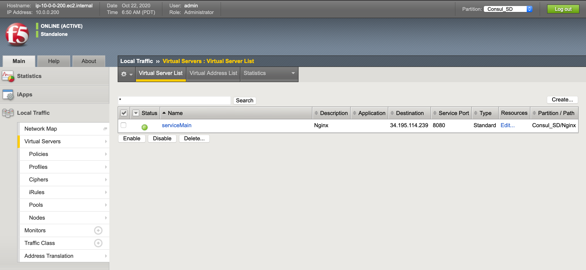

# Demonstrate the power of Consul integrated with the F5 BIG-IP Load Balancer via the AS3 interface.

This repository is a derivation of the F5 BIG-IP Consul SD webinar, updated for Terraform 12 and following a step-by-step demonstration flow.  Utilizing Consul with F5 in this fashion, a world of tickets and processes will float away, or at least be minimized (note, this statement has not been reviewed or approved by any legal entity).

Original repository:
https://github.com/hashicorp/f5-terraform-consul-sd-webinar

F5 Documentation:
https://clouddocs.f5.com/products/orchestration/terraform/latest/userguide/as3-integration.html

# System Layout


# Prerequisites
In order to execute the demonstration, the following items are required:
- AWS Credentials (if using Environment Variables, this is AWS_ACCESS_KEY_ID and AWS_SECRET_ACCESS_KEY)
- Public IP address of your workstation, entered as a variable.  This can be opened up/wildcarded, however, your security team might flip.
- Selected prefix to identify the resources created.

# Terraforming the Infrastructure
If desired the version of Consul can be adjusted by editing the `CONSUL_VERSION` variable within the `scripts/nginx.sh` and `scripts/consul.sh` files.  These files download, install, and configure the specified Consul version within the Consul Server and Consul Client (NGINX) nodes.  Note that Consul is NOT installed on the F5 BIG-IP load balancer.

Once you clone or fork the repository, run `terraform init` from the 'terraform' directory.  This will pull down any modules and dependencies necessary.

Next, execute `terraform plan` to evaluate the resources created, and ensure that you have access setup properly.

And now, the moment we've all been waiting, for....`terraform apply -auto-approve`.  The `-auto-approve` flag automatically approvevs the apply phase...shocking, I know.

Once the system is all installed, Terraform will output some very important information.  This information won't lead you to the lost Templar treasure, but it will lead you to the treasure of automation.

```
Outputs:

Consul_Server_IP = 10.0.0.100
Consul_UI = http://54.145.101.9:8500
F5_IP = 54.88.243.87
F5_Password = uXjiDTCiSm
F5_UI = https://54.88.243.87:8443
F5_Username = admin
```

# Validating the Infrastructure
Let's use that output to open up a couple browser tabs (as if you didn't have enough open already).  Open one tab for the Consul UI, and another for the F5 UI.  Note that for the F5 UI, you're browser is going to complain about the certificate...you probably want to accept that or you aren't going to be able to see the F5 UI.

The Consul UI won't ask for credentials, so feel free to browse around; the sales associates won't bother you.  The important bits to observe are the Nodes and the Services listed.  These are the nodes and services that Consul is aware of.  You can see similar data using the CLI.


If you wish to do this, set the CONSUL_HTTP_ADDR environment variable to the Consul Server IP and port.  For example, using the data from the example output:
`export CONSUL_HTTP_ADDR=54.145.101.9:8500`

Once you have that environment variable set, you can view the members of the Consul cluster using the following command:
`consul members`

This will show you all of the nodes that Consul is aware of, identifying the status and role (i.e., Server or Client).  If you want to view the services listed, execute the following command:
`consul catalog services`

Through the UI and the CLI, you will notice that there are two services registered with Consul, a "consul" service and an "nginx" service.  The Consul service is registered by default, and the Nginx service was configured in Consul as part of the Terraform setup.  Specifically this was completed in the "scripts/nginx.sh" script that Terraform applied to the AWS Auto-Scaling Group as user_data.

Note that there is only one Consul Server in this configuration.  Don't do that in production...Consul should really have 5 nodes for redundancy in any "real world" scenario.

Next, log into the F5 UI using the credentials in the Terraform output.  In the top right of the window, there is a pull-down for "Partitions."  Go ahead an pull that down to see the options...if you've followed along, you can't!  All you have is the default partition...so let's change that.

# Setting Up the Application Services

You'll want to grab that F5 username (admin) and the password (F5_Password).  Those values need to be base64 encoded to include them in a following step.  This can be done easily in Linux with the following command:
`echo -n 'admin:<password>' | base64`

For example, using the output above:
`echo -n 'admin:uXjiDTCiSm' | base64`

The output of that command will give you a bunch of gobbledygook (technical term), for example:
`YWRtaW46dVhqaURUQ2lTbQ==`

This value will be the base 64 encoded credentials which you'll use shortly.  The other bit of information you're going to need is the F5 Public IP address (F5_IP).  Have that, and the Consul_Server_IP (the PRIVATE address from the output) handy, and you're going to insert those values into the following cURL statement.

```
curl -k -X POST \
  https://<F5_IP>:8443/mgmt/shared/appsvcs/declare \
  -H 'authorization: Basic <base 64 encoded credentials>' \
  -d '{
    "class": "ADC",
    "schemaVersion": "3.7.0",
    "id": "Consul_SD",
        "controls": {
        "class": "Controls",
        "trace": true,
        "logLevel": "debug"
    },
    "Consul_SD": {
      "class": "Tenant",
      "Nginx": {
        "class": "Application",
        "template": "http",
        "serviceMain": {
          "class": "Service_HTTP",
          "virtualPort": 8080,
          "virtualAddresses": [
            "<F5_IP>"
          ],
          "pool": "web_pool"
        },
        "web_pool": {
          "class": "Pool",
          "monitors": [
            "http"
          ],
          "members": [
            {
              "servicePort": 80,
              "addressDiscovery": "consul",
              "updateInterval": 5,
              "uri": "http://<Consul_Server_IP>:8500/v1/catalog/service/nginx"
            }
          ]
        }
      }
    }
}
' | jq
```

In that cURL statement, you are inserting the IP address for the F5 twice, the credentials once, and the Consul Server IP (again, the PRIVATE address from the output).  Paste the cURL statement into your closest shell (terminal window, not a seashell), and let it fly.

It takes a couple of seconds depending on your modem baud rate, but once that's done, refresh the F5 UI tab and you should now be able to pull-down that "Partition" field, and select "Consul SD".


Within the Consul SD partition, check out the "Virtual Servers" within the "Local Traffic" section of the UI.  You should see a "serviceMain" Virtual Server name, with a Description of "Nginx."


Within that same "Local Traffic" section, check out the "Nodes" to see that all of the NGINX nodes that you configured show up here.


I know what you may be thinking..."OK that's all well and good, but how do I know you didn't perform some back end hackery?".  Well, prove it out!  There are a few ways to do this...

First option (and in my opinion the easiest), is to alter the Terraform Code, specifically the nginx.tf file.  Change the "desired_capacity" field within the "aws_autoscaling_group" resource.  Feel free to increase or decrease that number, and execute the "terraform apply -auto-approve" command again.  This will alter the number of nodes in that autoscaling group.  After a few minutes, you should see the number of nodes in the Consul system, as well as the F5, change to match your configuration.

Another way to perform this is to utilize the AWS CLI or UI to terminate a node.  This is a more abrupt approach, however, you can see the node go away, and the auto scaling group create a new one.

Now you have a system that can adjust the F5 configuration dynamically based on the nodes and services.  No tickets to manage.  No configuration to change.  And most importantly, no managers breathing down your necks about delayed schedules!

This now ends your consuling session, I hope you feel better about yourself, and the world around you!
